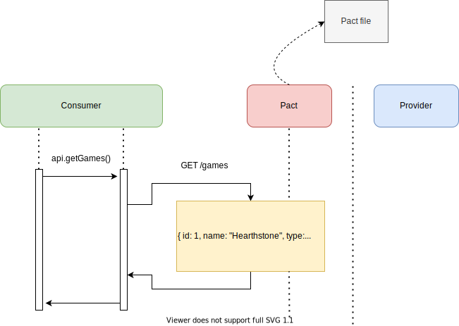
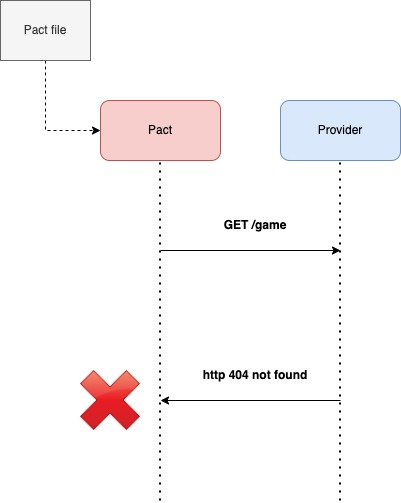

# Pactflow Workshop

## Introduction
This workshop is aimed at demonstrating core features and benefits of contract testing with Pactflow and contract testing.

This workshop should take from 1 to 2 hours, depending on how deep you want to go into each topic.And it is fully self-driven so you can just follow each step to finish it at your pace.

**Workshop outline**
- [Step 1: Setup environment](#step-1---setup-environment) create consumer and provider apps. 
- [Step 2 - Add consumer tests - REST API](#step-2---add-consumer-tests---rest-api) Add the first consumer test for REST API.
- [Step 3 - Add consumer tests - GraphQL](#step-3---add-consumer-tests---graphql) Add the consumer test for GraphQL endpoint.
- [Step 4 - Verify the provider](#step-4---verify-the-provider) Verify the pact at provider side.
- [Step 5 - Back to the client we go](#step-5---back-to-the-client-we-go) Fix the consumer test.

*NOTE: Each step is tied to, and must be run within, a git branch, allowing you to progress through each stage incrementally. For example, to move to a specific, you can run the following: `git checkout [step_index]`*

## Prerequisite
----
- [Docker](https://www.docker.com)
- [Docker Compose](https://docs.docker.com/compose/install/)
- [Node v14+](https://nodejs.org/en/)
- [Yarn v3](https://yarnpkg.com/)

*NOTE: Please follow this [guide](https://yarnpkg.com/getting-started/migration) to upgrade your local yarn to v3.*

## Step 1 - Setup environment
In this step, we need to first create an HTTP client to make the calls to our provider service:


The provider and consumer are built within a monorepo, managed by [Lerna](https://github.com/lerna/lerna). 

- *Consumer: React + Apollo-client*
- *Provider: Nest.js App (enabling both REST and GraphQL)*

To install the dependencies of the app, simply go to the root directory and run:
```
yarn install
```
We've set up two endpoints to use:
- GET /games - REST API to retrieve all the games.
- POST /graphql - Use GraphQL queries to fetch data. 

There's no need to establish any database connection as we are simply using a mock json as the source. It is saved under `/nest-provider/src/data/mock.json` feel free to update the data as you wish.

Running `localhost:5000/graphql` will open the GraphQL playground in the browser so you can interactively debug and test the queries. You can use the following query to fetch the data in our example:
```
query Games {
  games {
    data {
      id
      name
      url
      reviews {
        rating
        comment
      }
      type
    }
  }
}
```

The `api.js` has the REST api functions and we use `apollo-client` with `useQuery` hooks to fetch data via GraphQL endpoint.

**Run the apps**

To run the app, go to the root directory and run `yarn start`. Alternatively, you can go to each package and run them independently.

## Step 2 - Add consumer tests - REST API
Unit tests are written and executed in isolation of any other services. When we write tests for code that talk to other services, they are built on trust that the contracts are upheld. There is no way to validate that the consumer and provider can communicate correctly.

> *An integration contract test is a test at the boundary of an external service verifying that it meets the contract expected by a consuming service - [Martin Fowler](https://martinfowler.com/bliki/ContractTest.html)*

Now is time to add the first Pact test. Because of the natature of consumer-driven, we are going to start with the consumer tests.

You can find the api class in `/src/react-consumer/api.js`:

```
export class API {
  constructor(url) {
    if (url === undefined || url === '') {
      url = process.env.REACT_APP_API_BASE_URL;
    }
    if (url.endsWith('/')) {
      url = url.substr(0, url.length - 1);
    }
    this.url = url;
  }

  withPath(path) {
    if (!path.startsWith('/')) {
      path = '/' + path;
    }
    return `${this.url}${path}`;
  }

  async getGames() {
    const res = await axios.get(this.withPath('/game')).then((r) => r.data);
    return res;
  }
}
```

Firstly, we need to install the dependencies required for Pact:
```
yarn add @pact-foundation/pact @pact-foundation/pact-node
```

Then create a `/pact` folder under `/src`, and add `api.pact.spec.js`. 

Add the Pact config to the top:
```
const provider = new Pact({
  consumer: "YOUR_CONSUMER_NAME",
  provider: "YOUR_PROVIDER_NAME",
  log: path.resolve(process.cwd(), "logs", "pact.log"),
  logLevel: "warn",
  dir: path.resolve(process.cwd(), "pacts"),
  spec: 2
});
```
*NOTE: Please make sure you create the unique consumer and provider names, if using the same Pactflow account.*

Then you can add the following test for GET `/games` endpoint:
```
describe("API Pact test Game API - REST", () => {
  beforeAll(() => provider.setup());
  afterEach(() => provider.verify());
  afterAll(() => provider.finalize());

  describe("getting all games", () => {
    test("games exists", async () => {
      const expectedResult = {
        id: 1,
        name: "Heathstone",
        type: "TCG",
        url: "https://content.api.news/v3/images/bin/c316d90c344632190cbd595a42ac44ad",
        reviews: [
          { rating: 5, comment: "Great game!" },
          { rating: 4, comment: "Good game!" },
        ]
      };
      // set up Pact interactions
      await provider.addInteraction({
        state: "games exist",
        uponReceiving: "get all games",
        withRequest: {
          method: "GET",
          path: "/game",
        },
        willRespondWith: {
          status: 200,
          headers: {
            "Content-Type": "application/json; charset=utf-8",
          },
          body: eachLike(expectedResult),
        },
      });

      const gameAPI = new API(provider.mockService.baseUrl);

      // make request to Pact mock server
      const games = await gameAPI.getGames();
      expect(games).toStrictEqual([expectedResult]);
    });
  });
});
```

The above test looks very similar to the normal unit test with [Jest](https://jestjs.io/). 



This test starts a mock server a random port that acts as our provider service. To get this to work we update the URL in the Client that we create, after initialising Pact.

To simplify running the tests, add this to `react-consumer/package.json`:
```
// add it under scripts
"test:pact": "CI=true react-scripts test --testTimeout 30000 pact.spec.js"
```

Running this test should pass, and it creates a pact file which we can use to validate our assumptions on the provider side, and have conversation around.

```console
❯ yarn test:pact

PASS src/pact/api.pact.spec.js (14.28 s)
  API Pact test Game API - REST
    getting all games
      ✓ games exists (42 ms)

Test Suites: 1 passed, 1 total
Tests:       1 passed, 1 total
Snapshots:   0 total
Time:        15.462 s
Ran all test suites matching /pact.spec.js/i.
```

You can run `git checkout step2/add-consumer-rest-test` to complete this step too.

## Step 3 - Add consumer tests - GraphQL
Okay, if everything goes well with the above steps, we are pretty much set up at the consumer side. However, accordingly to the API usage, most of the requests at Brighte are via GraphQL endpoints. Let's add the GraphQL Pact tests now.

To avoid testing the UI and component logic, instead of testing `useQuery()` React hooks in Pact, we have to extract its business logic and test it independently. 

Let's create a folder `/graphql` to store all the queries and mutations, and add a file `query.js` inside. Then, you can copy the query from `App.js`, so the file looks like:
```
import { gql } from "@apollo/client";

const GET_GAMES_QUERY = gql`
  query Games {
      games {
        data {
          id
          name
          url
          reviews {
            rating
            comment
          }
          type
        }
      }
    }
`;

export {
  GET_GAMES_QUERY,
};
```

And you can replace the code of `App.js` with the above query:
```
import { GET_GAMES_QUERY } from './graphql/query';
...
const { loading, error, data } = useQuery(GET_GAMES_QUERY);
```

Once the above is done, we can add a new file `/src/pact/graphql.pact.spec.js` and add the following config of Pact instance at the top:
```
const provider = new Pact({
  consumer: "YOUR_CONSUMER_NAME",
  provider: "YOUR_PROVIDER_NAME",
  log: path.resolve(process.cwd(), "logs", "pact.log"),
  logLevel: "warn",
  dir: path.resolve(process.cwd(), "pacts"),
  spec: 2,
  pactfileWriteMode: 'merge',
});
```
The code should be very similar to step 2, but we've added `pactfileWriteMode: 'merge'` here. Because if you run pact testing with multiple files, they can run in parallel and the final output file will be override by whichever test file runs last. With this option set to `merge`, it will combine multiple pact test output into one pact file when it finishes testing.

Then you can add the following test for POST `/graphql` endpoint:
```
describe("API Pact test Game API - GraphQL", () => {
  let client;

  beforeAll(async () => {
    await provider.setup();
    client = new ApolloClient({
      link: new HttpLink({
        uri: `${provider.mockService.baseUrl}/graphql`,
        fetch,
      }),
      cache: new InMemoryCache({ addTypename: false }),
    });
  });

  afterEach(async () => {
    await provider.verify();
  });

  afterAll(async () => {
    await provider.finalize();
    client.stop();
  });

  test("games exists", async () => {
    const expectedResult = {
      id: 1,
      name: "Heathstone",
      type: "TCG",
      url: "https://content.api.news/v3/images/bin/c316d90c344632190cbd595a42ac44ad",
      reviews: [
        {
          rating: 5,
          comment: "Great game!",
        },
        {
          rating: 4,
          comment: "Good game!",
        },
      ]
    };

    const graphqlQuery = new GraphQLInteraction()
      .uponReceiving("get games query")
      .withQuery(print(GET_GAMES_QUERY))
      .withOperation("Games")
      .withVariables({})
      .withRequest({
        path: "/graphql",
        method: "POST",
      })
      .willRespondWith({
        status: 200,
        headers: {
          "Content-Type": "application/json; charset=utf-8",
        },
        body: {
          data: {
            games: {
              data: eachLike(expectedResult),
            },
          },
        },
      });

    provider.addInteraction(graphqlQuery);

    const res = await client.query({
      query: GET_GAMES_QUERY,
      variables: {},
    });
    expect(res.data.games.data).toStrictEqual([expectedResult]);
  });
});
```
A few things to be noticed here:

- We are calling `new GraphQLInteraction()` to add a GraphQL interaction to Pact test. It comes with some functions like `withQuery()`, `withVariables()`, etc to set the GraphQL queries and inputs.
- Initalise the apolloClient instance before the test:
```
client = new ApolloClient({
  link: new HttpLink({
    uri: `${provider.mockService.baseUrl}/graphql`,
    fetch,
  }),
  cache: new InMemoryCache({ addTypename: false }),
});
```
- Set test query with `print()` in the GraphQL interaction

If everything goes well, you can run `yarn test:pact` again and see the result:
```console
❯ yarn test:pact
PASS src/pact/api.pact.spec.js (5.071 s)
PASS src/pact/graphql.pact.spec.js (5.25 s)

Test Suites: 2 passed, 2 total
Tests:       2 passed, 2 total
Snapshots:   0 total
Time:        6.998 s
Ran all test suites matching /pact.spec.js/i.
```
And if you go to `/pacts` folder you should see the generated pact file with both REST and GraphQL tests inside.

## Step 4 - Verify the provider
We need to make the pact file (the contract) that was produced from the consumer test available to the Provider module. This will help us verify that the provider can meet the requirements as set out in the contract. For now, we'll hard code the path to where it is saved in the consumer test, in the later steps we investigate a better way of doing this.

Install the dependency first:
```console
> yarn add @pact-foundation/pact
```

Now let's make a start on writing Pact tests to validate the consumer contract:

Create a file in `/nest-provider/src/game/game.pact.spec.ts` and add the config at the top:
```
const opts: typeof VerifierOptions = {
  logLevel: 'info',
  providerBaseUrl: 'http://localhost:4000',
  provider: 'YOUR_PROVIDER',
  providerVersion: '1.0.0',
  pactUrls: [
      path.resolve(__dirname, '../../../react-consumer/pacts/YOUR_PRACT_FILE.json')
  ]
};
```
Then add the following test to verify the pact file:
```
describe('Pact Verification', () => {
  it('validates the expectations of ProductService', () => {
      if (process.env.CI || process.env.PACT_PUBLISH_RESULTS) {
          Object.assign(opts, {
              publishVerificationResult: true,
          });
      }
      return new Verifier(opts).verifyProvider().then(output => {
        console.log(output);
      }).finally(() => {
        app.close();
      });
  })
});
```
To simplify running the tests, add this to nest-provider/package.json:
```
// add it under scripts
"test:pact": "CI=true npx jest --testTimeout=30000 --testMatch \"**/*.pact.spec.ts\""
```

We now need to validate the pact generated by the consumer is valid, by executing it against the running service provider, which should fail:
```console
Failures:

      1) Verifying a pact between YOUR_CONSUMER and YOUR_PROVIDER Given games exist get all games with GET /game returns a response which has status code 200
         Failure/Error: expect(response_status).to eql expected_response_status

           expected: 200
                got: 404

           (compared using eql?)

      2) Verifying a pact between YOUR_CONSUMER and YOUR_PROVIDER Given games exist get all games with GET /game returns a response which has a matching body
         Failure/Error: expect(response_body).to match_term expected_response_body, diff_options, example

           Actual: {"statusCode":404,"message":"Cannot GET /game","error":"Not Found"}

           Diff
           --------------------------------------
           Key: - is expected
                + is actual
           Matching keys and values are not shown

           -[
           -  {
           -    "id": 1,
           -    "name": "Heathstone",
           -    "type": "TCG",
           -    "url": "https://content.api.news/v3/images/bin/c316d90c344632190cbd595a42ac44ad",
           -    "reviews": [
           -      {
           -        "rating": 5,
           -        "comment": "Great game!"
           -      },
           -      {
           -        "rating": 4,
           -        "comment": "Good game!"
           -      },
           -    ]
           -  },
           -]
           +{
           +  "statusCode": 404,
           +  "message": "Cannot GET /game",
           +  "error": "Not Found"
           +}


           Description of differences
           --------------------------------------
           * Expected an Array (like [{"id"=>1, "name"=>"Heathstone", "type"=>"TCG", "url"=>"https://content.api.news/v3/images/bin/c316d90c344632190cbd595a42ac44ad", "reviews"=>[{"rating"=>5, "comment"=>"Great game!"}, {"rating"=>4, "comment"=>"Good game!"}]}]) but got a Hash at $


    2 interactions, 1 failure

    Failed interactions:

    * Get all games given games exist (to re-run just this interaction, set environment variables PACT_DESCRIPTION="get all games" PACT_PROVIDER_STATE="games exist")

    WARN: Cannot publish verification for YOUR_CONSUMER as there is no link named pb:publish-verification-results in the pact JSON. If you are using a pact broker, please upgrade to version 2.0.0 or later.

      at ChildProcess.<anonymous> (../node_modules/@pact-foundation/pact-node/src/verifier.ts:275:58)

Test Suites: 1 failed, 1 total
Tests:       1 failed, 1 total
Snapshots:   0 total
Time:        4.939 s, estimated 5 s
```


The test has failed, as the expected path GET /game is returning 404. 

The correct endpoint which the consumer should call is GET /games.

## Step 5 - Back to the client we go
We now need to update the consumer client and tests to hit the correct api path.

First, we need to update the GET route for the client:

In `react-consumer/src/api.js`:
```
async getGames() {
  const res = await axios.get(this.withPath('/games')).then((r) => r.data);
  return res;
}
```

Then we need to update the Pact test to use the correct endpoint in path.

In `react-consumer/src/pact/api.pact.spec.js`:
```
await provider.addInteraction({
  state: "games exist",
  uponReceiving: "get all games",
  withRequest: {
    method: "GET",
    path: "/games",
  },
  willRespondWith: {
    status: 200,
    headers: {
      "Content-Type": "application/json; charset=utf-8",
    },
    body: eachLike(expectedResult),
  },
});
```
Let's run and generate an updated pact file on the client:
```console
> yarn test:pact
PASS src/pact/graphql.pact.spec.js
PASS src/pact/api.pact.spec.js

Test Suites: 2 passed, 2 total
Tests:       2 passed, 2 total
Snapshots:   0 total
Time:        6.417 s
Ran all test suites matching /pact.spec.js/i.
```
Now we run the provider tests again with the updated contract, run the command:
```console
PASS src/game/game.pact.spec.ts (8.391 s)
  Pact Verification
    ✓ validates the expectations of ProductService (1389 ms)

Test Suites: 1 passed, 1 total
Tests:       1 passed, 1 total
Snapshots:   0 total
Time:        8.535 s
Ran all test suites.
Jest did not exit one second after the test run has completed.
```
Yay - green ✅!

## Step 6 - Add error scenario
What happens when we make a call for the endpoint that doesn't exist? We assume we'll get a 404.

Let's write a test for these scenarios, and then generate an updated pact file.

In `nest-provider/src/game/game.service.ts` we add a new function to fetch a single game:
```
async getGame (id: number): Promise<Game> {
  const game = gamesData.data.find(game => game.id == id);
  return game;
}
```
And add a new route to `nest-provider/src/game/game.controller.ts`:
```
@Get('game/:id')
async getGame(@Param('id') id: number) {
  const response = await this.gameService.getGame(id);
  if (!response) {
    throw new NotFoundException('Invalid game')
  }
  return response;
}
```

In `react-consumer/src/api.js` add the following method:
```
async getGame(id) {
  const res = await axios.get(this.withPath(`/game/${id}`)).then((r) => r.data);
  return res;
}
```

In `react-consumer/src/pact/api.pact.spec.js` we add a new interaction to handle the error:
```
describe('get one game', () => {
  test("game does not exist", async () => {
    // set up Pact interactions
    await provider.addInteraction({
      state: 'game with id 3 does not exist',
      uponReceiving: 'get game with id 3',
      withRequest: {
        method: 'GET',
        path: '/game/3'
      },
      willRespondWith: {
        status: 404
      },
    });

    const gameAPI = new API(provider.mockService.baseUrl);

    // make request to Pact mock server
    await expect(gameAPI.getGame(3)).rejects.toThrow('Request failed with status code 404');
  });
})
```

After you've done every change above, you can run pact test in the terminal now to generate a new pact file (you can remove the old one manually):
```console
> yarn test:pact
PASS src/pact/api.pact.spec.js
PASS src/pact/graphql.pact.spec.js

Test Suites: 2 passed, 2 total
Tests:       3 passed, 3 total
Snapshots:   0 total
Time:        4.964 s
Ran all test suites matching /pact.spec.js/i.
```

Now if you go back to provider side and run `yarn test:pact`, you should see the following output:
```console
FAIL src/game/game.pact.spec.ts (7.641 s)
  Pact Verification
    ✕ validates the expectations of ProductService (1317 ms)

  ● Pact Verification › validates the expectations of ProductService

    INFO: Reading pact at /Users/mattyao/Documents/Work/Brighte/pactflow-workshop/packages/react-consumer/pacts/your_consumer-your_provider.json


    Verifying a pact between YOUR_CONSUMER and YOUR_PROVIDER

      Given games exist
        get all games
          with GET /games
            returns a response which

              has status code 200

              has a matching body

              includes headers

                "Content-Type" which equals "application/json; charset=utf-8"

      Given game with id 99 does not exist

        get game with id 99

          with GET /game/3

            returns a response which

              has status code 404 (FAILED - 1)

      Get games query

        with POST /graphql

          returns a response which

            has status code 200

            has a matching body

            includes headers

              "Content-Type" which equals "application/json; charset=utf-8"


    Failures:

      1) Verifying a pact between YOUR_CONSUMER and YOUR_PROVIDER Given game with id 99 does not exist get game with id 99 with GET /game/3 returns a response which has status code 404
         Failure/Error: expect(response_status).to eql expected_response_status

           expected: 404
                got: 200

           (compared using eql?)


    3 interactions, 1 failure


    Failed interactions:

    * Get game with id 99 given game with id 99 does not exist (to re-run just this interaction, set environment variables PACT_DESCRIPTION="get game with id 99" PACT_PROVIDER_STATE="game with id 99 does not exist")

    WARN: Cannot publish verification for YOUR_CONSUMER as there is no link named pb:publish-verification-results in the pact JSON. If you are using a pact broker, please upgrade to version 2.0.0 or later.

      at ChildProcess.<anonymous> (../node_modules/@pact-foundation/pact-node/src/verifier.ts:275:58)

Test Suites: 1 failed, 1 total
Tests:       1 failed, 1 total
Snapshots:   0 total
Time:        7.758 s, estimated 8 s
Ran all test suites.
Jest did not exit one second after the test run has completed.
```
We expected this failure, because the game we are requesing (id=3) does in fact exist! What we want to test for, is what happens if there is a different state on the Provider. This is what is referred to as "Provider states", and how Pact gets around test ordering and related issues.

We could resolve this by updating our consumer test to use a known non-existent game, but it's worth understanding how Provider states work more generally.


